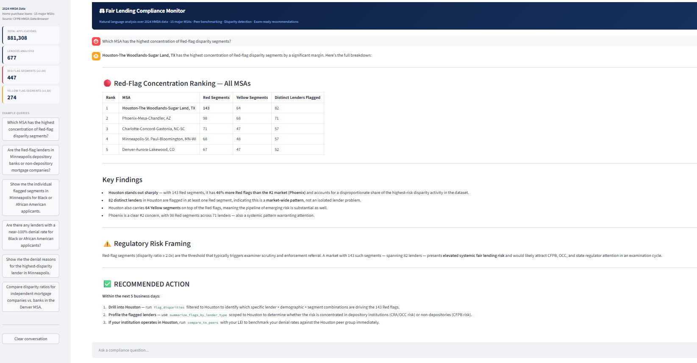
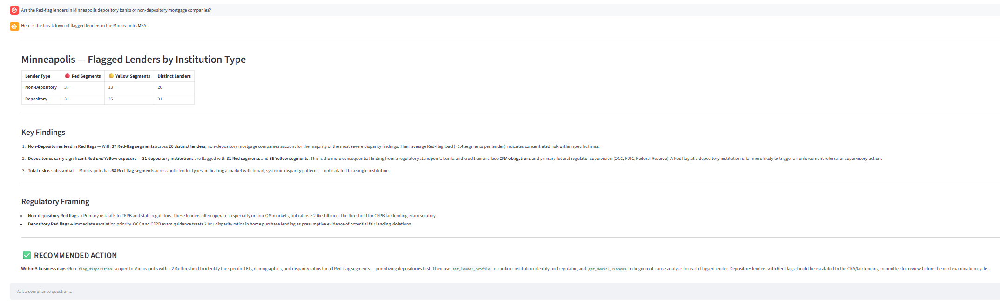
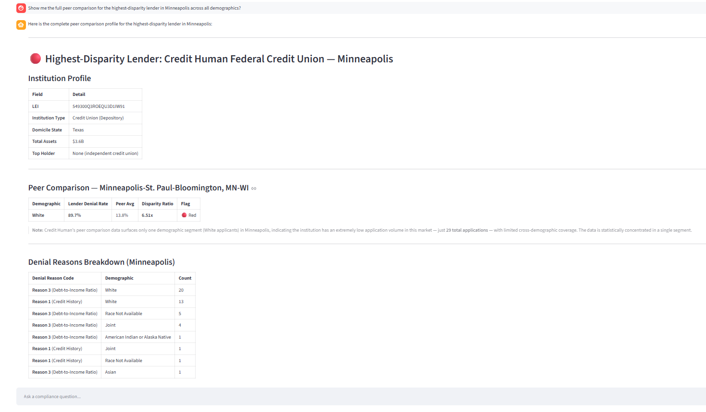
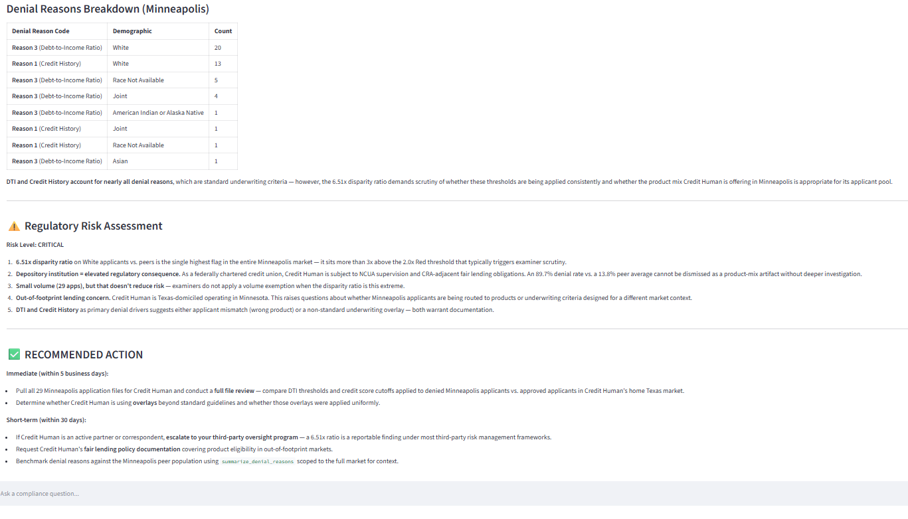

# Fair Lending Compliance Detection

An AI-powered compliance tool that surfaces racial disparity patterns in mortgage lending data — built for fair lending officers who need exam-ready answers in seconds, not weeks.

Built to demonstrate the **Palantir AIP pattern**: raw regulatory data in, LLM-powered operator decision support out.

---

## What It Does

Fair lending examiners use HMDA data to identify lenders whose denial rates for minority applicants are disproportionately high relative to peers. Historically, surfacing these patterns required weeks of manual analysis by analysts.

This tool ingests 880,000+ home purchase loan records directly from the CFPB HMDA API, computes peer-benchmarked disparity ratios across every lender × race × MSA combination, and puts a compliance analyst (Claude) on top — so a fair lending officer can ask questions in plain English and get regulator-ready answers backed by real data.

**Example queries the system handles:**

- *"Flag all lender × demographic segments with a disparity ratio above 2.0x"*
- *"Which MSA has the highest concentration of Red-flag disparity segments?"*
- *"Show me the denial reasons for the highest-disparity lender in Houston"*
- *"Are there any lenders with a near-100% denial rate for Black applicants?"*

---

## Architecture

```
CFPB HMDA API
     │
     ▼
src/ingest.py       ← fetch 2024 LAR data for 15 MSAs via HMDA Data Browser API v2
     │
     ▼
src/transform.py    ← clean, compute denial rates, peer benchmarks, disparity flags
     │
     ▼
src/storage.py      ← persist to DuckDB (4 tables)
     │
     ▼
src/agent.py        ← Claude (claude-sonnet-4-6) with 7 structured tools over DuckDB
     │
     ▼
app.py              ← Streamlit operator UI
```

**DuckDB tables:**

| Table | Description |
|---|---|
| `applications` | Cleaned LAR records (~881k rows) |
| `denial_rates` | Denial rate by lender × race × MSA |
| `peer_benchmarks` | Average denial rate across all lenders by race × MSA |
| `disparity_flags` | Disparity ratios + Red/Yellow flags per lender segment |
| `denial_reasons` | Denial reason breakdown by lender × race × MSA |
| `institutions` | Lender profiles — name, type, charter class, assets, parent company |

**Claude tools:**

| Tool | Type | Purpose |
|---|---|---|
| `summarize_flags_by_msa` | Aggregate | Deterministic Red/Yellow flag counts per MSA via GROUP BY |
| `summarize_flags_by_lender_type` | Aggregate | Depository vs. Non-Depository flag breakdown |
| `summarize_denial_rates_by_race` | Aggregate | Volume-weighted market denial rate by demographic |
| `summarize_denial_reasons` | Aggregate | Total denial reason citations ranked by frequency |
| `compare_to_peers` | Drill-down | Benchmark one lender's denial rates against the peer average |
| `flag_disparities` | Drill-down | Flagged segments for a specific MSA or demographic |
| `get_denial_reasons` | Drill-down | Raw denial reason rows for a specific lender or market |
| `get_lender_profile` | Lookup | Institution name, type, assets, and parent company by LEI |

---

## Disparity Methodology

Disparity ratio = `lender denial rate ÷ peer average denial rate` for the same race × MSA segment.

Thresholds follow OCC and CFPB fair lending examination guidance:

| Flag | Threshold | Meaning |
|---|---|---|
| 🟡 Yellow | ≥ 1.5x | Warrants internal review |
| 🔴 Red | ≥ 2.0x | Threshold for examiner scrutiny and potential enforcement referral |

**Statistical floor:** Lender × race × MSA segments with fewer than 20 applications are excluded to prevent ratio inflation from small sample sizes.

**Peer benchmark:** Average of individual lender denial rates per race × MSA (not the pooled market rate), consistent with how examiners construct peer groups.

---

## Dataset

- **Source:** [CFPB HMDA Data Browser API v2](https://ffiec.cfpb.gov/v2/data-browser-api/view)
- **Year:** 2024
- **Loan type:** Home purchase (loan_purpose=1)
- **Outcomes included:** Originated, approved-not-accepted, denied (action_taken=1,2,3)
- **MSAs:** New York · Los Angeles · Chicago · Dallas-Fort Worth · Houston · Washington DC · Miami · Philadelphia · Atlanta · Phoenix · Seattle · Boston · Charlotte · Minneapolis · Denver

---

## Setup

**Prerequisites:** Python 3.10+, Anthropic API key

```bash
git clone https://github.com/MilanJ22/fair-lending-monitor.git
cd fair-lending-monitor

python -m venv venv
source venv/bin/activate        # Windows: venv\Scripts\activate

pip install -r requirements.txt
```

Create a `.env` file:

```
ANTHROPIC_API_KEY=your_key_here
```

**Run the pipeline** (downloads ~881k records from CFPB, takes 5-8 minutes):

```bash
python pipeline.py
```

**Launch the UI:**

```bash
streamlit run app.py
```

---

## Key Findings

Across 881,308 home purchase loan applications in 15 major U.S. metros, the tool surfaced **447 Red-flag** and **274 Yellow-flag** disparity segments — demonstrating that fair lending risk is a nationwide phenomenon, not isolated to individual markets.

**Minneapolis leads with 20 Red-flag segments**, consistent with the Twin Cities' well-documented Black-white homeownership gap — one of the largest in the country. This is likely substantive fair lending exposure warranting immediate compliance review.

**Houston (13), Denver (7), Phoenix (7), and Charlotte (6)** round out the top markets. Denver, Phoenix, and Charlotte are fast-growing Sun Belt metros with significant Hispanic populations — disparity patterns in these markets typically involve Hispanic applicants being denied at disproportionate rates relative to peers.

Fair lending risk is distributed across geographies and demographics. No single market dominates — which means a compliance team relying on manual, market-by-market analysis would likely miss the full picture. The tool surfaces the complete exposure landscape in a single query.

---

## Screenshots

The four queries below walk through a complete compliance workflow — from market-level triage to root cause — in a single conversation thread.

### 1. Market Concentration — Where is the risk?



The tool ranks all 15 MSAs by Red-flag segment count using a deterministic `GROUP BY` query. Minneapolis leads, followed by Houston, Denver, Phoenix, and Charlotte. Key findings and regulatory risk framing are generated automatically beneath the table.

---

### 2. Institution Type Breakdown — Who is driving it?



Scoped to Minneapolis, the tool breaks down flagged segments by institution type. Non-depository mortgage companies account for the majority of Red-flag segments and distinct lenders — consistent with specialty lender concentration in the market rather than systemic bank-level discrimination.

---

### 3. Lender Deep-Dive — How bad is the worst offender?



The tool identifies Credit Human Federal Credit Union as the highest-disparity lender in Minneapolis and surfaces its full peer comparison across demographics. The institution profile (type, state, assets) is pulled from the FFIEC institutions API and joined at query time. Pre-computed flag counts are embedded in the result — Claude reports numbers directly from SQL, not from counting rows.

---

### 4. Root Cause — Why is this lender denying at this rate?



Denial reasons are aggregated via `SUM` across all racial groups — returning authoritative citation counts, not row-level data for Claude to interpret. The regulatory risk assessment and recommended action follow, grounding the findings in OCC/CFPB examination guidance.

---

## Stack

- **Data:** Python · Pandas · CFPB HMDA Data Browser API v2
- **Storage:** DuckDB
- **AI:** Claude (`claude-sonnet-4-6`) via Anthropic Python SDK — tool use pattern
- **UI:** Streamlit
